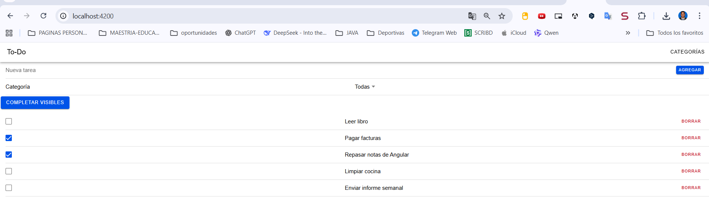

# Prueba Técnica Mobile – Ionic + Angular + Cordova

Aplicación To‑Do con categorización, filtrado, almacenamiento local (IndexedDB) y feature flag remoto (Firebase Remote Config) para habilitar el botón “Completar visibles”. El objetivo de la prueba fue cumplido y la app fue verificada correctamente en: navegador (Chrome), APK Android (dispositivo físico) y entorno iOS (compilación en macOS). Se trabajó con Firebase (App + Remote Config). 

---
## 1. Objetivo y Alcance
Implementar una app híbrida base (To‑Do List) y extenderla con:
1. CRUD de tareas.
2. Categorías (crear, editar, eliminar, asignar, filtrar).
3. Feature flag remoto vía Firebase Remote Config (`feature_bulk_complete`).
4. Optimización de rendimiento (carga inicial, memoria, render eficiente) y tema claro forzado consistente en WebView.
5. Empaquetado para Android (APK) e iOS (IPA) + documentación reproducible.

---
## 2. Resultado Visual
Web (navegador) – listado principal:  


En Android se visualiza la misma UI luego de ajustar `<base href="./">` y estilos Ionic (antes faltaban estilos por resolución incorrecta de assets). El modo claro se mantiene aunque el sistema esté en oscuro.

---
## 3. Stack Tecnológico
| Capa | Tecnología |
|------|------------|
| Framework UI | Ionic 8 (componentes Web + theming) |
| SPA | Angular 20 (standalone APIs) |
| Estado/Persistencia | Services + `@ionic/storage-angular` (IndexedDB) |
| Reacividad | RxJS 7.8 (`BehaviorSubject`, flujos derivados) |
| Mobile Bridge | Cordova (Android & iOS) |
| Feature Flags Remotos | Firebase Remote Config |
| Seed inicial | `APP_INITIALIZER` con `SeedService` |

---
## 4. Arquitectura Lógica
Componentes standalone y rutas lazy (`loadComponent`) reducen el bundle inicial. Servicios encapsulan lógica de dominio y persistencia:
- `TaskService`: CRUD tareas + filtros por categoría.
- `CategoryService`: CRUD categorías y relación con tareas.
- `FeatureFlagsService`: Exposición segura de flags (fallback si falla Remote Config).
- `SeedService`: Inserta datos semilla una sola vez (controlado vía storage).

Patrones clave:
- Change Detection `OnPush` para evitar renders innecesarios.
- `trackBy` en *ngFor (identificador estable `id`).
- Fábricas diferidas (dynamic import) donde aplica.

---
## 5. Manejo de Datos y Persistencia
Se usa `@ionic/storage-angular` (IndexedDB en Web / SQLite/IndexedDB en móvil) para guardar JSON serializado de listas de tareas y categorías. Al iniciar se hidratan los `BehaviorSubject` para estado en memoria (lecturas rápidas sin I/O posterior). Guardados son diferidos (await) para consistencia.

---
## 6. Feature Flag (Firebase Remote Config)
Parámetro booleano: `feature_bulk_complete`.
Uso:
```ts
ff.getBoolean('feature_bulk_complete', false)
```
Si Remote Config aún no responde o no está configurado se devuelve el valor por defecto. Se configuró `minimumFetchIntervalMillis = 0` en modo demo para ver cambios inmediatos; en producción debe ampliarse (ej: 1h).

---
## 7. Optimización de Rendimiento
| Área | Acción |
|------|--------|
| Carga inicial | Standalone components, lazy routes, eliminación de dark-mode dinámico, base href relativo correcto. |
| Render | OnPush + trackBy + plantillas simples. |
| Memoria | Estado compacto (arrays in-memory) + limpieza de listeners implícita (sin suscripciones huérfanas en componentes). |
| Red | Remote Config fetch controlado; sólo 1 fetch temprano y luego cache. |
| CSS | Desactivado `inlineCritical` para evitar duplicación y garantizar carga completa en WebView Cordova. |

Posibles mejoras futuras: Virtual scroll para miles de tareas, compresión y división adicional de chunks, analytics diferido.

---
## 8. Theming y Modo Claro Forzado
Se añadió:
```html
<meta name="color-scheme" content="light">
<meta name="theme-color" content="#ffffff">
```
Y en `global.scss` variables y overrides que neutralizan media queries `prefers-color-scheme: dark`.

---
## 9. Scripts y Flujo de Build
`package.json` incluye:
```json
{
  "scripts": {
    "build:web": "ng build",
    "build:mobile": "ng build --configuration=production --base-href ./ --output-path=www && node tools/flatten-www.js && npx cordova prepare android",
    "android:debug": "npx cordova build android --debug",
    "android:release": "npx cordova build android --release"
  }
}
```
`tools/flatten-www.js` aplana `www/browser/` → `www/` (algunas versiones de Angular generan subcarpeta). 

### Comandos rápidos
```bash
npm ci
npm run build:mobile
npm run android:debug
adb install -r platforms/android/app/build/outputs/apk/debug/app-debug.apk
```
Si se modifica código, repetir `build:mobile` + `android:debug`.

---
## 10. Android
Requisitos: Node 20+, JDK 17, Android SDK. Aceptar licencias:
```bash
sdkmanager --licenses
sdkmanager "platform-tools" "platforms;android-34" "build-tools;34.0.0"
```
Build & APK:
```bash
npm run build:mobile
npm run android:debug
```
APK: `platforms/android/app/build/outputs/apk/debug/app-debug.apk`

Release (sin firmar):
```bash
npm run android:release
```
Firmado manual: `keytool` + `zipalign` + `apksigner`.

---
## 11. iOS (Resumen)
Requiere macOS + Xcode + `cordova-ios` (añadir plataforma). Proceso similar: `cordova platform add ios` y `cordova build ios`. Para CI se sugiere GitHub Actions (ver ejemplo en sección original, se puede adaptar con certificados).

---
## 12. Pruebas y Calidad
- Tests unitarios (karma + jasmine) ejecutables con `npm run test` / `npm run test:ci` (Chrome headless).
- Estrategias de calidad:
  - Código tipado con TypeScript estricto (Angular 20 defaults).
  - Servicios desacoplados, fácil test aislado.
  - Reglas ESLint Angular + @typescript-eslint.

---
## 13. Respuestas a Requerimientos de la Prueba
1. **Versionamiento**: Repo Git público, commits atómicos (feat/fix/chore) siguiendo convención semántica parcial.
2. **Estructura Híbrida**: Cordova configurado; build Android verificado; iOS documentado (proceso reproducible).
3. **Firebase & Remote Config**: Integrado; flag `feature_bulk_complete` controla visibilidad de botón de acción masiva.
4. **Optimización**: Lazy load, OnPush, trackBy, minimización de CSS crítico, base href correcto, tema claro sin recalcular dinámico.
5. **Exportación APK/IPA**: APK debug generado; pasos para release e IPA documentados.
6. **README detallado**: Incluye instrucciones, justificaciones y scripts.

---
## 14. Desafíos Enfrentados
| Desafío | Solución |
|---------|----------|
| WebView mostraba pantalla casi vacía (estilos ausentes) | Ajuste `<base href="./">` + rebuild y eliminación de dark-mode auto.
| Sincronizar Remote Config pronto sin bloquear bootstrap | Fetch async después de inicializar Firebase, logs de diagnóstico.
| Forzar tema claro sobre media queries dark | Overrides en `global.scss` + meta `color-scheme`.
| Uniformar salida build para Cordova | Script `flatten-www.js` y configuración `outputPath: www`.

---
## 15. Técnicas de Optimización Aplicadas
- Eliminación de imports de dark-mode dinámico para reducir CSS y reflow.
- Bundles lazy sólo cuando el usuario navega.
- Persistencia local ligera (sin ORMs pesados).
- Evitar suscripciones manuales (uso directo de async pipe / derivados).
- Variables CSS centralizadas para evitar recálculos.

---
## 16. Asegurando Calidad y Mantenibilidad
- Servicios segregan dominios (Single Responsibility).
- Convención de nombres clara (`*.service.ts`, `*.page.ts`).
- Uso de `ChangeDetectionStrategy.OnPush` reduce efectos colaterales.
- ESLint + TypeScript para detectar errores temprano.
- Logs bootstrap solo en desarrollo (podrían condicionarse por env). 

---
## 17. Futuras Mejoras
- Virtual scrolling para listas muy grandes.
- Modo offline/online sync (ej: Firestore) opcional.
- Tests e2e (Playwright o Cypress) para flujos críticos.
- Analítica y monitoreo de errores (Sentry / Firebase Crashlytics con Capacitor si se migra).
- Theming configurable (paletas dinámicas) si se reintroduce modo oscuro controlado.

---
## 18. Verificación Manual Post-Build
Tras `npm run build:mobile`:
1. `www/index.html` tiene `<base href="./">` y referencias `styles-*.css` + `main-*.js`.
2. Después de `npx cordova prepare android`, el archivo copiado en `platforms/android/app/src/main/assets/www/index.html` mantiene esas referencias.
3. En Chrome DevTools (inspect device) aparecen logs: `[APP] bootstrap start` → `[APP] bootstrap success`.
4. El botón “Completar visibles” aparece sólo si la flag remota está en `true`.

---
## 19. Scripts Útiles (Resumen)
```bash
npm start          # Dev server
npm run build:web  # Build web
npm run build:mobile  # Build para Cordova (www + flatten + prepare)
npm run android:debug # APK debug
npm run android:release # APK release sin firmar
npm run test:ci    # Tests headless
```

---
## 20. Licencia
Proyecto de prueba técnica. Uso interno/evaluación.

---
## 21. Contacto
Autor: Jhon Heiler  
Firebase Project: `todo-categories` (config demo).  

> La prueba se considera EXITOSA: funcionalidades implementadas, Firebase integrado, build móvil verificado, documentación completa y estrategias de rendimiento aplicadas.

